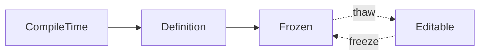
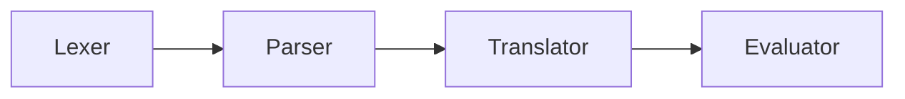
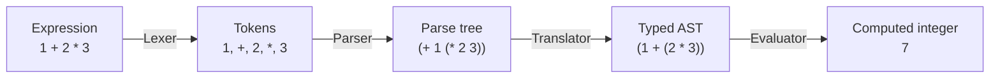
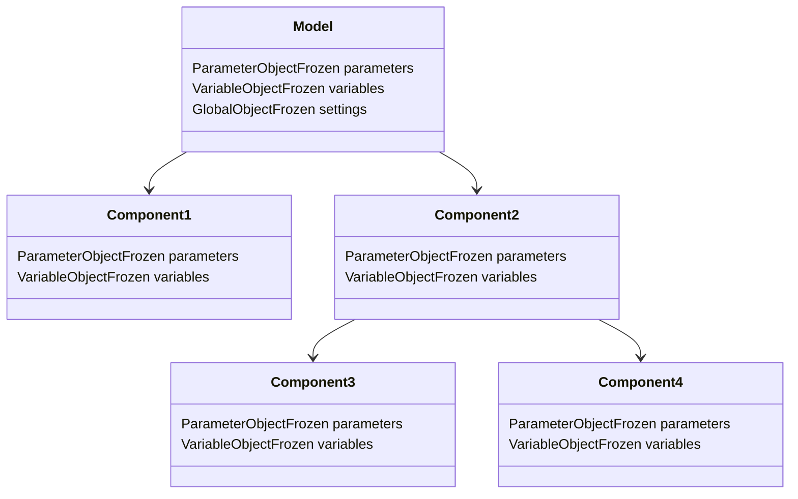

# Data Lifecycle

This section of the documentation goes over how data flows through the application.

- Datastore – Storage data in the various files and built-in components.
- Expression Engine – The process of evaluating the data in the datastore and returning computed data.
- Files – The various files that store data for the application.
- Preprocessing – The process of reading the files and converting them into a format that can be used by the simulation
  engine.
- Simulation – The process of running the simulation using the data from the datastore and files.

## Datastore

The datastore is a hierarchical data structure that stores the data for the components in the application.

The main idea behind the datastore is to create definitions that serve as the interface to the component with default
values.
The users will create instances of the definitions in the form of Frozen data that will be used in the application.

### Forms

The datastore is divided into four forms:

- CompileTime
- Definition
- Frozen
- Editable

#### CompileTime

A definition that is known at compile time and is not changed by the user. Designed to be used for the built-in
components.

This form is locked down to macros to prevent the Rust compiler from generating code that is non-const.
The macros only wrap the constructors
with [const blocks](https://doc.rust-lang.org/reference/expressions/block-expr.html#const-blocks) to ensure that the
data is known at compile time.

#### Definition

Interfaces for the components that are used to create instances of the component. The definition is used to create
frozen data used in the application.

Definition builders are used to create/modify the definitions. With User Defined Components, the users will be able to
create their own definitions and use them in the application.

#### Frozen

Instances of the definitions that are used in the application. The frozen data is designed to not be easily modified by
the user.

The Frozen data only allows users to change data through the editable form, which is then merged back into the frozen
form.
This is done to prevent the users from accidentally changing the definition of the data.

A side effect of this is that when we get to User Defined Components, if the users change the definition of the
component, it will not affect the existing frozen data items created from the original definition.
This helps to merge the data back into the new definition when the users change the definition of the component.

#### Editable

The editable form is used to allow the users to change the data in the frozen form.

Note that the editable form is a copy of the frozen form and is not directly linked to the frozen form.
`thaw` and `freeze` functions are used to convert between the two forms.

### Types

The datastore is made up of the following types structure (keyed objects) and base types (strings).

The idea is to store as much of the data as possible as strings to allow for the expression engine to evaluate the data
and return computed data.

For example, if the users enter `sin(30)` in a field, the expression engine will evaluate the string and return `0.5` as
the computed data.

Structure:

- Global Object – Top level object with keys starting with `g_`. Typically used for Simulation Settings and other global
  data.
- Parameter Object – Top level object with keys starting with `p_`. These are used for the parameters of the
  components/model in the application.
- Variable Object – Top level object with keys starting with `v_`. These are used for the variables of the
  components/model in the application.
- Map – A structured collection of entries, each containing a defined set of fields that may use different base types.

Base Types:

- Boolean – A true or false value with custom display values.
- Choice – A selection from a predefined list of options.
- File – A file path to a file on the system.
- Folder – A folder path to a folder on the system.
- Integer – A whole number.
- Number – A numeric value.
- Number with Unit – A numeric value with an associated unit.
- Separator – A visual separator for the GUI.
- String – A sequence of characters.
- Tab – A visual tab for the GUI.
- Table – A collection of rows and columns for organizing numbers.
- Table with Unit – A table where each column can have an associated unit.
- Unit – Represents a unit of measurement.

## Expression Engine

The expression engine is responsible for evaluating the data in the datastore and returning computed data.

Each entry in the datastore can have an expression associated with it that is evaluated by the expression engine.

The flow of data through the expression engine is as follows:

1. Lexer – The lexer takes the string input and converts it into a series of tokens that can be used by the parser.
2. Parser – The parser takes the tokens from the lexer and converts them into an abstract syntax tree (AST) that can be
   used by the translator. This handles order of operations and operator precedence.
3. Translator – The translator takes the AST from the parser and converts it into a form that can be used by the
   evaluator.
4. Evaluator – The evaluator takes the translated form and evaluates it to return the computed data.

Here is an example of how the expression engine works with the expression `1 + 2 * 3`:

### Computed Types

The expression engine returns computed data as one of the following Rust-based types:

- Boolean – A true or false value (`bool`).
- Integer – An integer value (`i64`).
- Number – A floating-point number (`f64`).
- Number with Unit – A floating-point number with a concrete unit value (`f64`, `UnitId`).
- String – A sequence of characters (`ShareableString`).
- Identifier – A named value that can be resolved from computed data (`ShareableString`).
- Path – A file or folder path (`ShareableString`).
- Table – A `ComputedTable` containing named columns and numeric rows (`Vec<Vec<f64>>`).
- Table with Units – A `ComputedTableWithUnits` with a canonical unit for one or more columns (`Vec<UnitId>`).
- Unit – A unit of measurement (`UnitId`).

### Expression Engine with Model/Component Data

The expression engine can also evaluate expressions that reference data in the datastore.

The model owns its global settings and component hierarchy. Components own their parameters, variables, and child
components, while using the model's global settings as shared evaluation context.

### Engine State and Evaluation Scopes

An `ExpressionEngine` owns the computed global data and the callable function definitions used by every evaluation. A
new engine starts with the built-in globals and functions. Global data is the only evaluation result retained by the
engine; parameter and variable evaluations return computed objects to the caller, which supplies them to later
evaluation stages.

This creates a top-down component evaluation order. Evaluate a model's
parameters, then its variables, and use `extend_globals` for settings that
must become available to descendant components. For each child, evaluate its
parameters with the parent's computed parameters and variables, then evaluate
the child's variables. The child results become the context for its own
children.

For example, a model may calculate `v_impact_factor` from `p_payload_kg`, then
extend globals with `g_design_load_n` that references both values. A child can
then use `g_design_load_n` in its parameters without receiving the model's
parameter or variable objects directly.
